## 练习3

### 目标
练习依赖倒转原则

### 源数据

+ txt源  
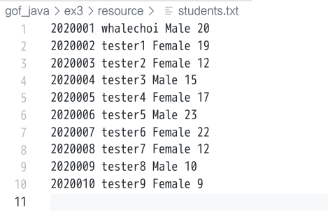

+ sqlite源  
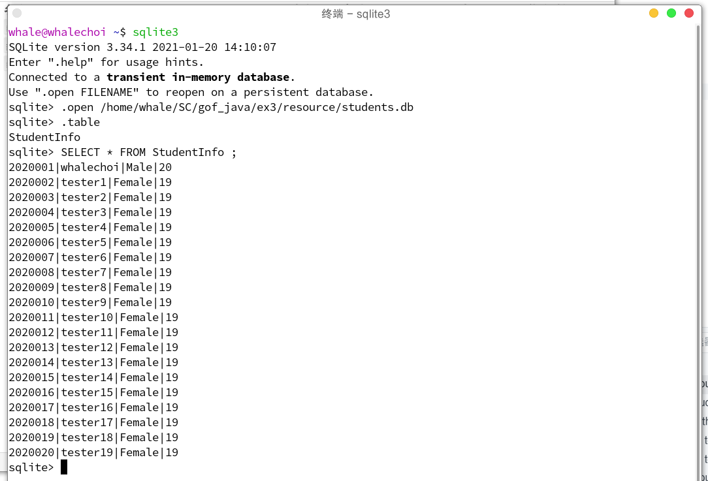

### 运行样例
+ txt转换xml
  + 配置`config.xml`  
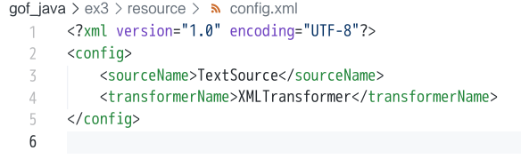
  + 程序运行时终端输入输出  
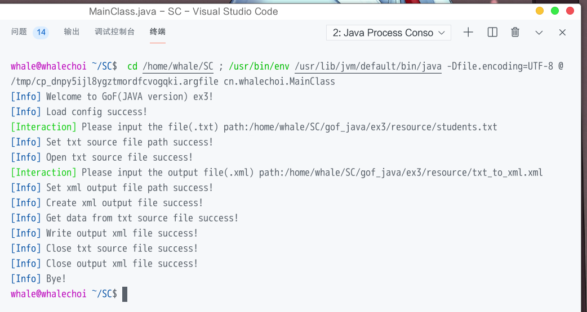
  + 程序运行结果  
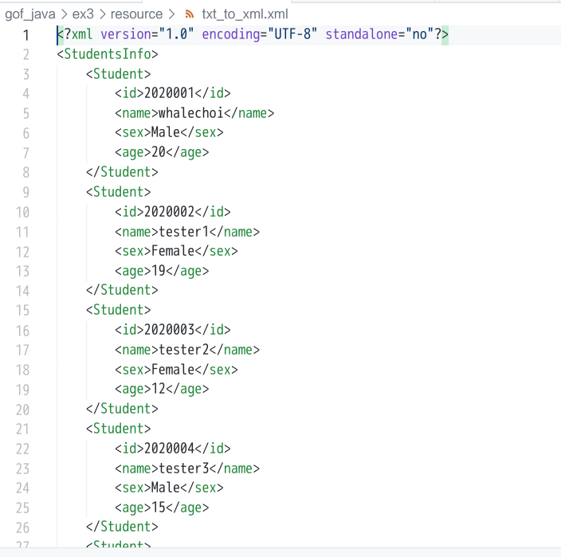

+ txt转换xlsx
  + 配置`config.xml`  
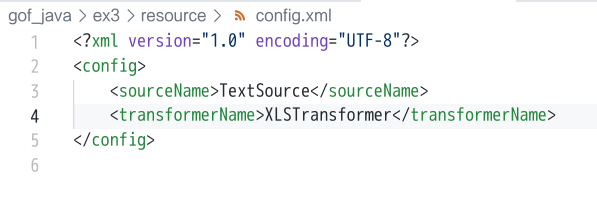
  + 程序运行时终端输入输出  
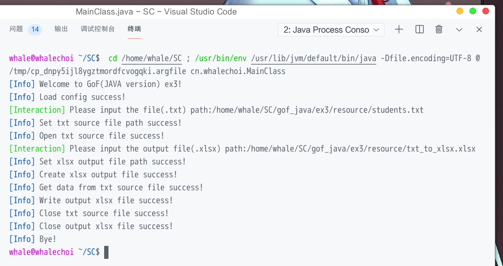
  + 程序运行结果  
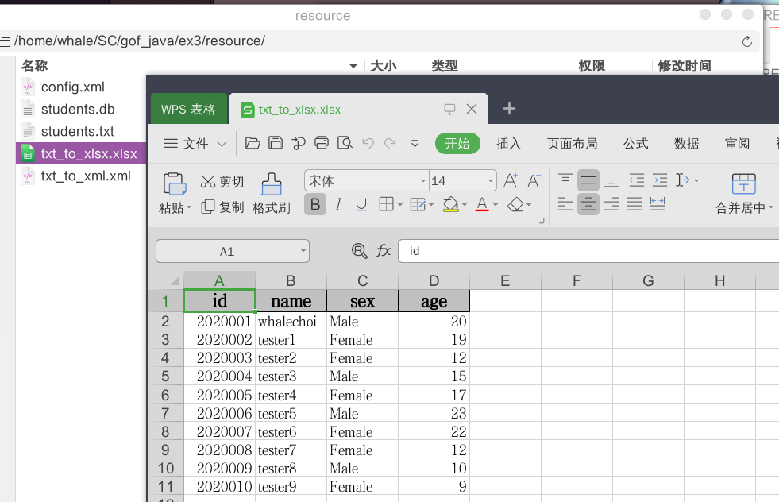

+ db转换xml
  + 配置`config.xml`  
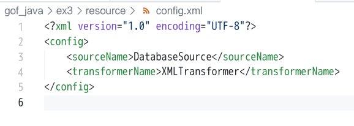
  + 程序运行时终端输入输出  
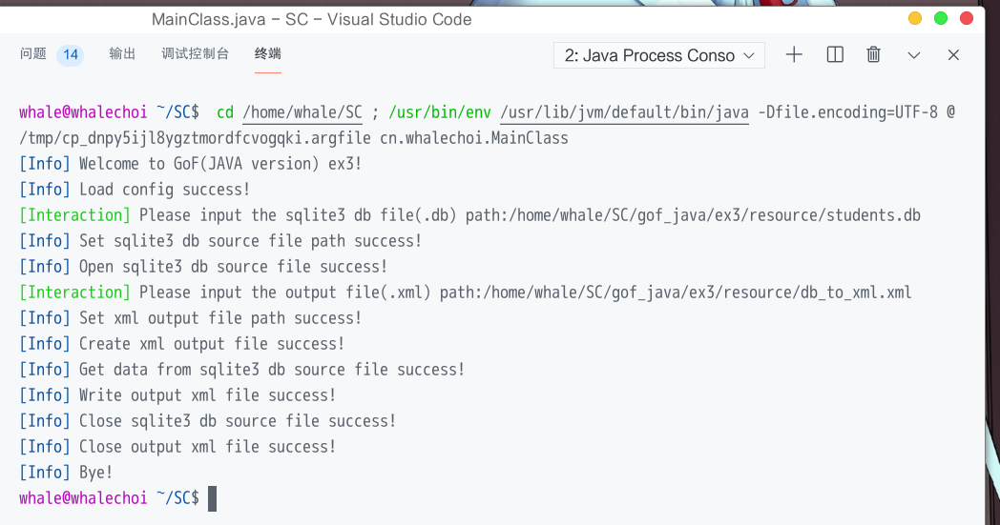
  + 程序运行结果  
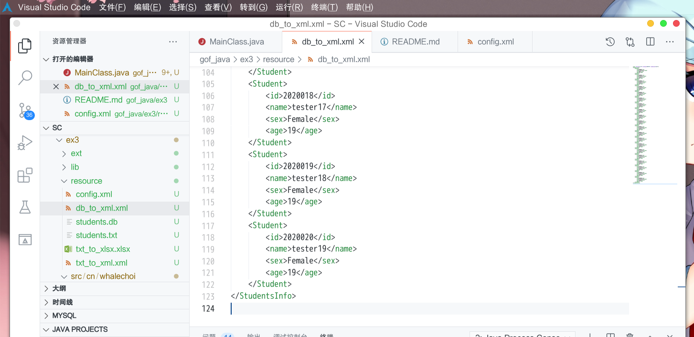

+ db转换xlsx
  + 配置`config.xml`  
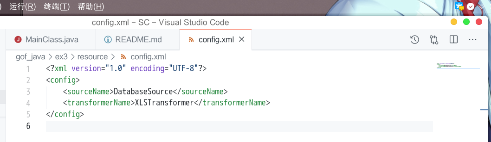
  + 程序运行时终端输入输出  
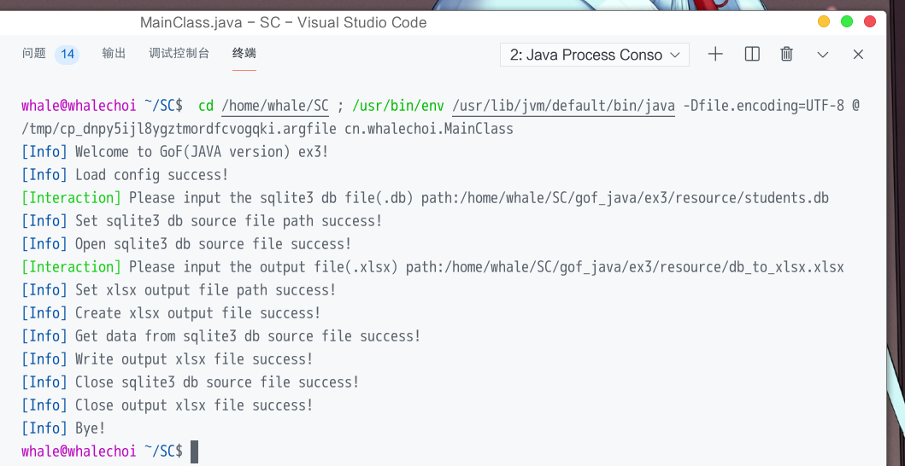
  + 程序运行结果  
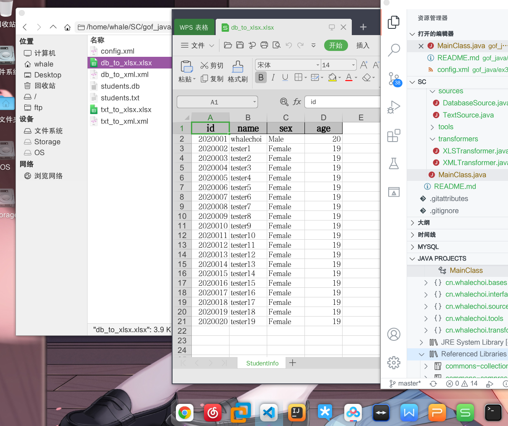
